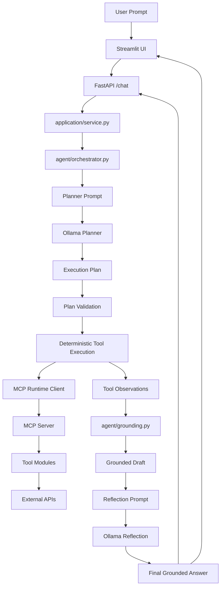

# Weekend Wizard (L2 Agent Project)

A lightweight local AI agent that helps answer:

**"What should I do this weekend?"**

Weekend Wizard combines a local LLM, MCP-exposed tools, and a controlled orchestration layer to build short, grounded weekend suggestions using real public data.

The system can pull:

- current weather
- book recommendations
- a safe joke
- a random dog photo
- optional trivia

Unlike a freestyle controller loop, this project uses a bounded agent design:

**LLM plans once -> orchestrator validates -> tools execute deterministically -> grounding builds a draft -> LLM reflects once**

This keeps the system agentic while preserving reliability, explainability, and a clean local runtime story.

---

## Architecture Overview

Weekend Wizard follows a planner/executor/reflection architecture:

1. Prompt interpretation and planning
2. Deterministic tool execution through MCP
3. Grounded response generation with one reflection pass



### Execution Flow

1. Streamlit sends the user prompt to FastAPI.
2. The planner LLM produces one structured execution plan.
3. The orchestrator validates the plan schema and semantics.
4. The executor runs each planned MCP tool step in order.
5. Tool outputs are stored as structured `ToolObservation`s.
6. Grounding builds a draft answer from real observations.
7. The reflection LLM performs one lightweight correction pass.
8. The final grounded answer is returned to the UI.

---

## What It Does

Weekend Wizard supports prompts like:

- "Plan a cozy Saturday in New York with today's weather, 3 mystery book ideas, a joke, and a dog pic."
- "I'm at 40.7128, -74.0060. Give me the weather, one joke, and a dog photo."
- "Give me one trivia question."

Supported tool-backed capabilities:

- weather via Open-Meteo
- city-to-coordinates lookup via Open-Meteo geocoding
- book recommendations via Open Library
- a safe one-liner joke via JokeAPI
- a random dog photo URL via Dog CEO
- optional trivia via Open Trivia DB

`trivia` is intentionally supported as an explicit request, not as automatic enrichment for unrelated prompts.

---

## Project Structure

```text
weekend-wizard/
|- main.py
|- api.py
|- streamlit_app.py
|- llm_client.py
|- mcp_server.py
|- requirements.txt
|- README.md
|- evaluations/
|  |- cases.json
|  |- run_evaluations.py
|
|- scripts/
|  |- dev_up.py
|
|- application/
|  |- service.py
|
|- agent/
|  |- grounding.py
|  |- orchestrator.py
|  |- prompts.py
|  |- policies/
|     |- guardrails.py
|
|- config/
|  |- config.py
|
|- logger/
|  |- logging.py
|
|- mcp_runtime/
|  |- client.py
|  |- registry.py
|
|- schemas/
|  |- agent.py
|  |- api.py
|  |- tools.py
|
|- tools/
|  |- books.py
|  |- entertainment.py
|  |- geo.py
|  |- shared.py
|  |- weather.py
|
|- tests/
|  |- smoke/
|  |  |- smoke_test.py
   |- integration/
   |- unit/
```

---

## Components

### 1. Streamlit UI (`streamlit_app.py`)

The Streamlit app provides the local interactive interface.

Responsibilities:

- collect prompts
- send requests to the backend
- render the final answer and tool observations

---

### 2. FastAPI Backend (`api.py`)

This module exposes the runtime over HTTP.

Responsibilities:

- expose `/chat`, `/health`, and `/ready`
- own the shared runtime lifecycle
- return structured responses using the configured runtime model

---

### 3. Runtime Service (`application/service.py`)

This layer owns shared runtime state for each application session.

Responsibilities:

- initialize the MCP-backed runtime
- resolve the configured model and discovered tools
- create per-request interaction context
- dispatch interactions through the orchestrator

---

### 4. Orchestrator (`agent/orchestrator.py`)

This is the core runtime brain.

Responsibilities:

- build planner messages
- call the planner LLM once
- validate plan schema and semantics
- normalize tool arguments before execution
- execute MCP tools deterministically
- record `ToolObservation`s
- build grounded draft answers
- run one reflection pass
- return bounded failure behavior when planning or reflection is unreliable

---

### 5. Prompts (`agent/prompts.py`)

This module builds prompt payloads for:

- the planner step
- the one-shot reflection step

---

### 6. Grounding (`agent/grounding.py`)

This module keeps the answer tied to observed tool output.

Responsibilities:

- parse serialized tool payloads
- normalize tool outputs
- compose grounded answers from observations

---

### 7. MCP Runtime (`mcp_runtime/client.py`)

This is the tool execution boundary.

Responsibilities:

- connect to the MCP server
- discover tools
- invoke tools with structured arguments
- return results to the orchestrator

---

### 8. Ollama Integration (`llm_client.py`)

This module manages local LLM interaction through Ollama.

Responsibilities:

- discover available local models
- call the planner LLM
- call the reflection LLM
- perform one repair attempt for invalid planner/reflection JSON

---

## Running the Project

### 1. Install dependencies

```powershell
cd "C:\Users\MohitKapadiya\Desktop\New folder\genai\L2_agents\weekend-wizard"
python -m venv .venv
.\.venv\Scripts\Activate.ps1
python -m pip install -r .\requirements.txt
```

---

### 2. Configure local environment

The repo now supports loading settings from a local `.env` file.

Use `.env.example` as the template and keep your real `.env` local-only:

```powershell
Copy-Item .\.env.example .\.env
```

At minimum, make sure `WEEKEND_WIZARD_API_KEY` is set in `.env`.

You can also control observability behavior with:

- `WEEKEND_WIZARD_OBSERVABILITY_MODE=local`
- `WEEKEND_WIZARD_OBSERVABILITY_MODE=staging`
- `WEEKEND_WIZARD_OBSERVABILITY_MODE=production`

---

### 3. Ensure Ollama is running

Make sure a local chat model is available:

```powershell
ollama list
```

If needed:

```powershell
ollama pull llama3.1:8b
```

---

### 4. Use the local operator runner

```powershell
python .\scripts\dev_up.py check
python .\scripts\dev_up.py api
python .\scripts\dev_up.py streamlit
```

This is the single operator-facing entrypoint for local bring-up. The `check` subcommand verifies:

- the configured Ollama model is resolvable
- Ollama is reachable
- the MCP runtime can initialize
- tools can be discovered successfully

---

### 5. Useful URLs

- `http://127.0.0.1:8000/health`
- `http://127.0.0.1:8000/ready`
- `http://127.0.0.1:8000/docs`

---

### 6. Optional: run the MCP server directly

```powershell
python .\main.py mcp-server
```

---

### 7. Run tests

```powershell
.\.venv\Scripts\python.exe -m unittest discover -s tests -v
```

---

### 8. Run the smoke test

```powershell
.\.venv\Scripts\python.exe .\tests\smoke\smoke_test.py --prompt "Tell me a joke."
```

---

### 9. Run contract evaluations

```powershell
.\.venv\Scripts\python.exe .\evaluations\run_evaluations.py
```

This runs a small supported-prompt evaluation set and scores the API against simple contract checks such as:

- required tools are present
- forbidden tools are absent
- minimum observations are returned
- the final answer is non-empty

For latency-focused analysis, use:

```powershell
.\.venv\Scripts\python.exe .\evaluations\run_evaluations.py --timing
```

---

## Configuration

Configuration is managed through environment variables and repo config.

Example values:

```env
OLLAMA_URL=http://127.0.0.1:11434/api/chat

WEEKEND_WIZARD_REQUEST_TIMEOUT=600
WEEKEND_WIZARD_HTTP_MAX_RETRIES=2
WEEKEND_WIZARD_HTTP_RETRY_BACKOFF_SECONDS=0.5
WEEKEND_WIZARD_API_KEY=replace-with-a-shared-secret

WEEKEND_WIZARD_OBSERVABILITY_MODE=local
WEEKEND_WIZARD_LOG_LEVEL=INFO
WEEKEND_WIZARD_API_URL=http://127.0.0.1:8000
```

Notes:

- the active runtime model is configured in [config/config.py](C:/Users/MohitKapadiya/Desktop/New%20folder/genai/L2_agents/weekend-wizard/config/config.py)
- `WEEKEND_WIZARD_API_KEY` is required by the protected `/ready` and `/chat` endpoints and must be shared by the backend, Streamlit client, smoke test, and evaluation runner
- `WEEKEND_WIZARD_OBSERVABILITY_MODE` controls the logging profile:
  - `local` keeps readable developer-focused logs
  - `staging` keeps readable logs and appends request correlation plus richer engineer-friendly telemetry
  - `production` keeps the key request, auth, failure, and timing telemetry with lower-noise operational logging
- `WEEKEND_WIZARD_API_URL` controls where Streamlit sends requests
- `WEEKEND_WIZARD_REQUEST_TIMEOUT` is especially relevant for slower local Ollama runs

---

## Health Check

### `/health`

Confirms that the API process is alive.

### `/ready`

Checks whether the backend runtime is actually usable, including:

- Ollama reachability
- configured model availability
- MCP session readiness
- discovered tools

---

## Design Decisions

### Local-first runtime

Weekend Wizard uses a local Ollama model rather than a hosted API.

Advantages:

- privacy-friendly local execution
- no external LLM API cost
- reproducible runtime environment
- strong alignment with the training project goal

---

### Planner / executor / reflection split

The system uses:

**LLM plans -> system executes -> LLM reflects**

instead of:

- fully deterministic no-LLM orchestration
- messy per-step LLM controller loops

This gives the project:

- agentic behavior
- deterministic execution after planning
- clearer debugging and testing boundaries
- better control over tool usage

---

### MCP as the tool boundary

Tools are exposed and invoked through MCP rather than embedded directly into prompt logic.

Advantages:

- clear system boundaries
- structured tool invocation
- easier observability
- cleaner separation between agent logic and external APIs

---

### One reflection pass only

Reflection is deliberately limited to a single pass.

This keeps the final answer:

- grounded
- concise
- less prone to looping or re-planning

---

## Sample Prompts

```text
Plan a cozy Saturday in New York with today's weather, 3 mystery book ideas, a joke, and a dog pic.
```

```text
I'm at 40.7128, -74.0060. Give me the current weather, one joke, and a dog photo.
```

```text
Give me one trivia question.
```

---

## Known Limitations

This implementation is a strong local L2 prototype, but a few practical tradeoffs remain.

Limitations:

- local-model latency is still noticeable, especially for planning and reflection on larger models
- runtime quality is model-sensitive, with stronger local models producing better plans at the cost of slower responses
- the system is intentionally bounded to the supported tool-backed flows rather than open-ended general agent behavior

These tradeoffs prioritize:

- clarity
- reliability
- grounded behavior
- explainable execution

over unrestricted flexibility.

---

## Summary

Weekend Wizard demonstrates a local MCP-backed agent that:

- uses Ollama to produce one execution plan
- executes tool calls deterministically through MCP
- grounds answers in real fetched data
- runs one lightweight reflection pass before replying

The architecture is intentionally modular, bounded, and explainable, making it a solid L2-style agent project rather than a fragile controller loop demo.
