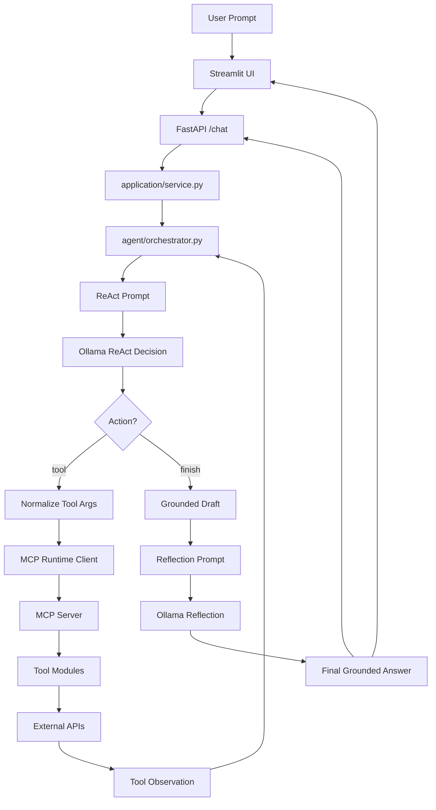

# Weekend Wizard (L2 ReAct Agent Project)

A lightweight local AI agent that helps answer:

**"What should I do this weekend?"**

Weekend Wizard combines a local LLM, MCP-exposed tools, and a bounded ReAct loop to build short, grounded weekend suggestions using real public data.

The system can pull:

- current weather
- book recommendations
- a safe joke
- a random dog photo
- optional trivia

This branch is intentionally aligned to the original L2 assignment:

**perceive -> decide -> act -> observe -> repeat -> reflect once**

The agent decides one next step at a time, calls MCP tools when needed, observes the result, and stops when it has enough information to answer.

---

## Architecture Overview

Weekend Wizard follows a bounded ReAct-style architecture:

1. the user prompt enters the runtime
2. the LLM decides the next action
3. the orchestrator either executes one tool or finishes
4. tool observations are appended to history
5. the loop repeats until the model finishes or the step budget is reached
6. one reflection pass lightly corrects the final answer



### Execution Flow

1. Streamlit sends the user prompt to FastAPI.
2. The ReAct LLM produces one bounded JSON decision.
3. If the decision is a tool call, the orchestrator validates and executes it through MCP.
4. The tool observation is added to conversation history.
5. Steps 2 to 4 repeat until the model chooses `finish` or the max step budget is reached.
6. Grounding builds a draft answer from real observations.
7. The reflection LLM performs one lightweight correction pass.
8. The final grounded answer is returned to the UI.

---

## What It Does

Weekend Wizard supports prompts like:

- "Plan a cozy Saturday in New York with today's weather, 3 mystery book ideas, a joke, and a dog pic."
- "I'm at 40.7128, -74.0060. Give me the weather, one joke, and a dog photo."
- "Give me one trivia question."

Supported tool-backed capabilities:

- weather via Open-Meteo
- city-to-coordinates lookup via Open-Meteo geocoding
- book recommendations via Open Library
- a safe one-liner joke via JokeAPI
- a random dog photo URL via Dog CEO
- optional trivia via Open Trivia DB

`trivia` is intentionally supported as an explicit request, not as automatic enrichment for unrelated prompts.

---

## Project Structure

```text
weekend-wizard/
|- main.py
|- api.py
|- streamlit_app.py
|- llm_client.py
|- mcp_server.py
|- requirements.txt
|- README.md
|
|- application/
|  |- service.py
|
|- agent/
|  |- grounding.py
|  |- orchestrator.py
|  |- prompts.py
|  |- policies/
|     |- guardrails.py
|
|- config/
|  |- config.py
|
|- logger/
|  |- logging.py
|
|- mcp_runtime/
|  |- client.py
|  |- registry.py
|
|- schemas/
|  |- agent.py
|  |- api.py
|  |- tools.py
|
|- tools/
|  |- books.py
|  |- entertainment.py
|  |- geo.py
|  |- shared.py
|  |- weather.py
|
|- tests/
|  |- smoke/
|  |  |- smoke_test.py
|  |- integration/
|  |- unit/
```

---

## Components

### 1. Streamlit UI (`streamlit_app.py`)

The Streamlit app provides the local interactive interface.

Responsibilities:

- collect prompts
- send requests to the backend
- render the final answer and tool observations

---

### 2. FastAPI Backend (`api.py`)

This module exposes the runtime over HTTP.

Responsibilities:

- expose `/chat`, `/health`, and `/ready`
- own the shared runtime lifecycle
- return structured responses using the configured runtime model

---

### 3. Runtime Service (`application/service.py`)

This layer owns shared runtime state for each application session.

Responsibilities:

- initialize the MCP-backed runtime
- resolve the configured model and discovered tools
- create per-request interaction context
- dispatch interactions through the orchestrator

---

### 4. Orchestrator (`agent/orchestrator.py`)

This is the core runtime brain.

Responsibilities:

- build one bounded ReAct prompt per step
- call the ReAct LLM for the next decision
- validate the decision and supported tool use
- normalize tool arguments before execution
- execute MCP tools one step at a time
- record `ToolObservation`s
- build grounded draft answers
- run one reflection pass
- return bounded failure behavior if the loop becomes unreliable

---

### 5. Prompts (`agent/prompts.py`)

This module builds prompt payloads for:

- each bounded ReAct decision
- the one-shot reflection step

---

### 6. Grounding (`agent/grounding.py`)

This module keeps the answer tied to observed tool output.

Responsibilities:

- parse serialized tool payloads
- normalize tool outputs
- compose grounded answers from observations

---

### 7. MCP Runtime (`mcp_runtime/client.py`)

This is the tool execution boundary.

Responsibilities:

- connect to the MCP server
- discover tools
- invoke tools with structured arguments
- return results to the orchestrator

---

### 8. Ollama Integration (`llm_client.py`)

This module manages local LLM interaction through Ollama.

Responsibilities:

- discover available local models
- call the bounded ReAct LLM
- call the reflection LLM
- perform one repair attempt for invalid ReAct or reflection JSON

---

## Running the Project

### 1. Install dependencies

```powershell
cd "C:\Users\MohitKapadiya\Desktop\New folder\genai\L2_agents\weekend-wizard"
python -m venv .venv
.\.venv\Scripts\Activate.ps1
python -m pip install -r .\requirements.txt
```

---

### 2. Ensure Ollama is running

Make sure a local chat model is available:

```powershell
ollama list
```

If needed:

```powershell
ollama pull llama3.1:8b
```

---

### 3. Start the API

```powershell
python .\main.py api
```

---

### 4. Start Streamlit

```powershell
python .\main.py streamlit
```

Useful URLs:

- `http://127.0.0.1:8000/health`
- `http://127.0.0.1:8000/ready`
- `http://127.0.0.1:8000/docs`

---

### 5. Optional: run the MCP server directly

```powershell
python .\main.py mcp-server
```

---

### 6. Run tests

```powershell
.\.venv\Scripts\python.exe -m unittest discover -s tests -v
```

---

### 7. Run the smoke test

```powershell
.\.venv\Scripts\python.exe .\tests\smoke\smoke_test.py --prompt "Tell me a joke."
```

---

## Configuration

Configuration is managed through environment variables and repo config.

Example values:

```env
OLLAMA_URL=http://127.0.0.1:11434/api/chat

WEEKEND_WIZARD_REQUEST_TIMEOUT=600
WEEKEND_WIZARD_HTTP_MAX_RETRIES=2
WEEKEND_WIZARD_HTTP_RETRY_BACKOFF_SECONDS=0.5

WEEKEND_WIZARD_LOG_LEVEL=INFO
WEEKEND_WIZARD_API_URL=http://127.0.0.1:8000
```

Notes:

- the active runtime model is configured in [config/config.py](C:/Users/MohitKapadiya/Desktop/New%20folder/genai/L2_agents/weekend-wizard/config/config.py)
- `WEEKEND_WIZARD_API_URL` controls where Streamlit sends requests
- `WEEKEND_WIZARD_REQUEST_TIMEOUT` is especially relevant for slower local Ollama runs

---

## Health Check

### `/health`

Confirms that the API process is alive.

### `/ready`

Checks whether the backend runtime is actually usable, including:

- Ollama reachability
- configured model availability
- MCP session readiness
- discovered tools

---

## Design Decisions

### Local-first runtime

Weekend Wizard uses a local Ollama model rather than a hosted API.

Advantages:

- privacy-friendly local execution
- no external LLM API cost
- reproducible runtime environment
- strong alignment with the training project goal

---

### Minimal bounded ReAct loop

The system uses:

**LLM decides one next action -> system executes -> LLM decides again**

with:

- a strict JSON decision schema
- a max step budget
- deterministic tool execution
- one reflection pass at the end

This gives the project:

- clear ReAct-style behavior for the assignment
- bounded runtime behavior
- easy-to-follow tool traces
- cleaner debugging than an unrestricted free-form loop

---

### MCP as the tool boundary

Tools are exposed and invoked through MCP rather than embedded directly into prompt logic.

Advantages:

- clear system boundaries
- structured tool invocation
- easier testing
- cleaner separation between agent logic and external APIs

---

### One reflection pass only

Reflection is deliberately limited to a single pass.

This keeps the final answer:

- grounded
- concise
- less prone to looping or re-planning

---

## Sample Prompts

```text
Plan a cozy Saturday in New York with today's weather, 3 mystery book ideas, a joke, and a dog pic.
```

```text
I'm at 40.7128, -74.0060. Give me the current weather, one joke, and a dog photo.
```

```text
Give me one trivia question.
```

---

## Known Limitations

This implementation is a strong local L2 prototype, but a few practical tradeoffs remain.

Limitations:

- local-model latency is still noticeable, especially across multiple ReAct steps and reflection
- runtime quality is model-sensitive, with stronger local models producing better step decisions at the cost of slower responses
- the system is intentionally bounded to the supported tool-backed flows rather than open-ended general agent behavior

These tradeoffs prioritize:

- clarity
- assignment alignment
- grounded behavior
- explainable execution

over unrestricted flexibility.

---

## Summary

Weekend Wizard demonstrates a local MCP-backed ReAct-style agent that:

- uses Ollama to decide one next action at a time
- executes tool calls deterministically through MCP
- observes real tool output before deciding what to do next
- runs one lightweight reflection pass before replying

The architecture is intentionally modular, bounded, and teachable, making it a strong L2-style capstone implementation for the original assignment.
