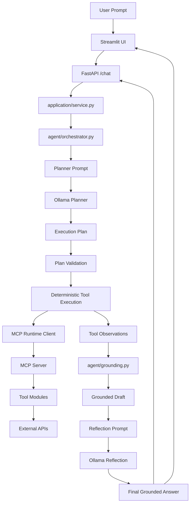

# Weekend Wizard

A local MCP-powered weekend-planning agent that uses:

- **Ollama** for planning and one-shot reflection
- **FastAPI** as the backend runtime
- **Streamlit** as the interactive UI
- **MCP** as the tool execution boundary

The current architecture is:

**LLM plans once -> orchestrator validates -> tools execute deterministically -> grounding builds a draft -> LLM reflects once**

That keeps the system agentic without falling back into a noisy step-by-step controller loop.

---

## What It Does

Weekend Wizard helps answer prompts like:

- "Plan a cozy Saturday in New York with today's weather, 3 mystery book ideas, a joke, and a dog pic."
- "I'm at 40.7128, -74.0060. Give me the weather, one joke, and a dog photo."
- "Give me one trivia question."

Supported tool-backed capabilities:

- weather via Open-Meteo
- city-to-coordinates lookup via Open-Meteo geocoding
- book recommendations via Open Library
- a safe one-liner joke via JokeAPI
- a random dog photo URL via Dog CEO
- optional trivia via Open Trivia DB

`trivia` is supported, but it should only appear when the user explicitly asks for it.

---

## Architecture



### Execution flow

1. Streamlit sends the prompt to FastAPI.
2. The planner LLM produces one structured execution plan.
3. The orchestrator validates that plan.
4. The executor runs each planned MCP tool step in order.
5. Tool outputs are stored as structured `ToolObservation`s.
6. Grounding builds a draft answer from real observations.
7. The reflection LLM does one lightweight correction pass.
8. The final grounded answer is returned to the UI.

This is intentionally not a freestyle "LLM decides every micro-step forever" design.

---

## Project Structure

```text
weekend-wizard/
|- main.py
|- api.py
|- streamlit_app.py
|- llm_client.py
|- mcp_server.py
|- smoke_test.py
|- requirements.txt
|- README.md
|
|- application/
|  |- service.py
|
|- agent/
|  |- grounding.py
|  |- orchestrator.py
|  |- prompts.py
|  |- policies/
|     |- guardrails.py
|
|- config/
|  |- config.py
|
|- logger/
|  |- logging.py
|
|- mcp_runtime/
|  |- client.py
|  |- registry.py
|
|- schemas/
|  |- agent.py
|  |- api.py
|  |- tools.py
|
|- tools/
|  |- books.py
|  |- entertainment.py
|  |- geo.py
|  |- shared.py
|  |- weather.py
|
|- tests/
   |- integration/
   |- unit/
```

---

## Core Components

### `streamlit_app.py`

Thin UI client for local interactive use.

Responsibilities:

- collect prompts
- send them to the backend
- render final answer and tool observations

### `api.py`

Backend HTTP surface.

Responsibilities:

- expose `/chat`, `/health`, and `/ready`
- own the shared runtime
- return structured chat responses

### `application/service.py`

Runtime/session owner.

Responsibilities:

- initialize the MCP-backed app session
- resolve tools and model name
- create per-request interaction context
- dispatch one interaction through the orchestrator

### `agent/orchestrator.py`

This is the core runtime brain.

Responsibilities:

- build planner messages
- call the planner LLM once
- validate the plan schema and semantics
- normalize tool args
- execute MCP tools deterministically
- record `ToolObservation`s
- build grounded draft answers
- run one reflection pass
- fall back safely when planning or reflection fails

### `agent/prompts.py`

Prompt construction for:

- the planner step
- the one-shot reflection step

### `agent/grounding.py`

Grounds the response in actual fetched tool data.

Responsibilities:

- parse serialized tool payloads
- normalize tool outputs
- compose the final answer from observations

### `mcp_runtime/client.py`

Tool execution boundary.

Responsibilities:

- connect to the MCP server
- discover tools
- invoke tools with structured args
- return results to the orchestrator

### `llm_client.py`

Local LLM integration through Ollama.

Responsibilities:

- discover available local models
- call the planner LLM
- call the reflection LLM
- do one repair attempt for invalid planner/reflection JSON

---

## Current Agent Design

The repo is now using a **planner/executor/reflection** design rather than the older step-by-step controller loop.

### Planner

The LLM returns a structured plan like:

- goal
- location
- book topic
- requested tools
- ordered execution steps

### Executor

The orchestrator validates the plan, then runs the steps in order.

Examples:

- `city_to_coords -> get_weather`
- `book_recs`
- `random_joke`
- `random_dog`
- `trivia` only when requested

### Reflection

After deterministic execution, the system:

- builds a grounded draft answer
- runs one reflection pass
- falls back to the grounded draft if reflection fails

This keeps reflection useful without letting it re-plan the task.

---

## Running the Project

### 1. Install dependencies

```powershell
cd "C:\Users\MohitKapadiya\Desktop\New folder\genai\L2_agents\weekend-wizard"
python -m venv .venv
.\.venv\Scripts\Activate.ps1
python -m pip install -r .\requirements.txt
```

### 2. Ensure Ollama is running

Make sure a local chat model is available:

```powershell
ollama list
```

If needed:

```powershell
ollama pull mistral:7b
```

### 3. Start the API

```powershell
python .\main.py api
```

### 4. Start Streamlit

```powershell
python .\main.py streamlit
```

Useful URLs:

- `http://127.0.0.1:8000/health`
- `http://127.0.0.1:8000/ready`
- `http://127.0.0.1:8000/docs`

### 5. Optional: run the MCP server directly

```powershell
python .\main.py mcp-server
```

### 6. Run tests

```powershell
.\.venv\Scripts\python.exe -m unittest discover -s tests -v
```

### 7. Run the smoke test

```powershell
.\.venv\Scripts\python.exe .\smoke_test.py --prompt "Tell me a joke."
```

---

## Environment Variables

Example values:

```env
OLLAMA_URL=http://127.0.0.1:11434/api/chat
OLLAMA_MODEL=mistral:7b

WEEKEND_WIZARD_REQUEST_TIMEOUT=600
WEEKEND_WIZARD_HTTP_MAX_RETRIES=2
WEEKEND_WIZARD_HTTP_RETRY_BACKOFF_SECONDS=0.5

WEEKEND_WIZARD_MAX_STEPS=9
WEEKEND_WIZARD_LOG_LEVEL=INFO
WEEKEND_WIZARD_API_URL=http://127.0.0.1:8000
```

Notes:

- `OLLAMA_MODEL` can override model selection.
- `WEEKEND_WIZARD_API_URL` controls where Streamlit sends requests.
- `WEEKEND_WIZARD_REQUEST_TIMEOUT` matters for slower local Ollama runs.
- `WEEKEND_WIZARD_MAX_STEPS` is now mostly legacy from the earlier controller design and is not the main interaction control path anymore.

---

## Health and Readiness

### `/health`

Confirms the API process is alive.

### `/ready`

Checks whether the backend runtime is actually usable, including:

- Ollama reachable
- model resolved
- MCP session initialized
- tools discovered

---

## Sample Prompts

```text
Plan a cozy Saturday in New York with today's weather, 3 mystery book ideas, a joke, and a dog pic.
```

```text
I'm at 40.7128, -74.0060. Give me the current weather, one joke, and a dog photo.
```

```text
Give me one trivia question.
```

---

## Fallback Behavior

The runtime has explicit fallback rules:

- if planning fails, return a clear bounded-scope failure message
- if a tool fails, keep other steps running where possible and answer honestly
- if reflection fails, return the grounded draft answer

This avoids hidden mode-switching and keeps failures explainable.

---

## What Is Strong Right Now

- planner/executor/reflection split
- MCP as a clean tool boundary
- grounded answer composition
- local Ollama runtime
- Streamlit over FastAPI with one backend-owned execution path
- much cleaner logging and debuggability than the earlier controller-heavy version

---

## What Still Needs Tightening

The architecture is now in the right family, but a few things still need work to feel production-grade for this scope.

### 1. Planner precision

The planner should:

- include only tools the user asked for
- avoid optional extras unless explicitly requested
- avoid unnecessary dependency steps

Example: `trivia` should stay supported, but should not be auto-added to unrelated prompts.

### 2. Stronger semantic plan validation

The orchestrator should reject plans that:

- add unrequested optional tools
- include unnecessary steps
- overreach beyond what the prompt justifies

### 3. Latency tightening

Planning and reflection are still slower than they should be for a bounded task, especially on smaller local models.

---

## Big-Picture Design Choice

This repo is intentionally moving toward a more disciplined local-agent design:

**LLM plans -> system executes -> LLM reflects**

instead of either:

- fully deterministic no-LLM orchestration, or
- messy per-step LLM controller loops

For this problem size, that is the right balance between:

- agentic behavior
- reliability
- observability
- bounded scope

---

## Summary

Weekend Wizard is a local, MCP-backed planning agent that:

- uses Ollama to produce one execution plan
- executes tool calls deterministically through MCP
- grounds answers in real fetched data
- runs one lightweight reflection pass before replying

The current repo is no longer in the old sloppy-controller shape. The remaining work is mostly about planner discipline and validation precision, not another architecture rewrite.
