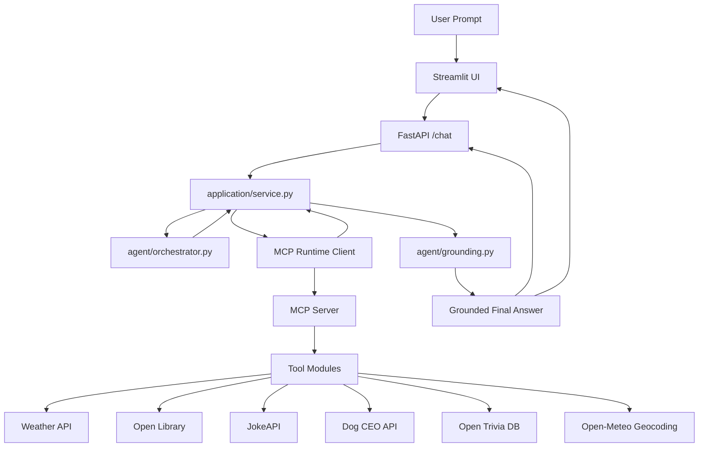

# Weekend Wizard (L2.5 Agent Project)

A lightweight **tool-using local agent** that helps answer a practical question:

**"What should I do this weekend?"**

The system uses a local LLM through **Ollama** to decide when tool calls are needed, executes those tools through **MCP**, and returns a grounded final answer using fetched results such as weather, books, jokes, trivia, and dog images.

This implementation emphasizes **clarity, modular design, and production-oriented structure** while still keeping the core agent loop easy to inspect.

---

## Architecture Overview

The system follows a thin-client demo over a backend-owned agent runtime:

1. Interface Layer
2. Agent Decision Loop
3. MCP Tool Execution
4. Grounded Answer Composition



---

## Project Structure

```text
weekend-wizard/
|
|- main.py
|- api.py
|- streamlit_app.py
|- llm_client.py
|- mcp_server.py
|- smoke_test.py
|- requirements.txt
|- README.md
|
|- application/
|  |- service.py
|
|- agent/
|  |- orchestrator.py
|  |- grounding.py
|  |- prompts.py
|  |- policies/
|     |- guardrails.py
|
|- config/
|  |- config.py
|
|- logger/
|  |- context.py
|  |- logging.py
|
|- mcp_runtime/
|  |- client.py
|  |- registry.py
|
|- schemas/
|  |- agent.py
|  |- api.py
|  |- tools.py
|
|- tools/
|  |- books.py
|  |- entertainment.py
|  |- geo.py
|  |- shared.py
|  |- weather.py
|
|- tests/
   |- integration/
   |- unit/
```

---

## Components

### 1. Interface Layer (`streamlit_app.py`, `api.py`)

The project exposes two supported interfaces:

- **Streamlit** for demo and interactive use
- **FastAPI** for production-style HTTP serving

#### Responsibilities

- Streamlit collects prompts and renders responses
- FastAPI owns runtime startup, orchestration, and tool execution
- FastAPI returns structured responses that Streamlit can display directly

#### Design Note

Streamlit is a thin demo client. FastAPI is the only interface that owns the MCP-backed runtime.

---

### 2. Shared Application Service (`application/service.py`)

This module provides the backend runtime used by FastAPI.

#### Responsibilities

- initialize the MCP-backed runtime
- resolve available tools
- create interaction contexts
- run one agent interaction through the orchestrator

#### Design Note

The service owns **shared runtime resources**, while the API creates **interaction context** per request.

This keeps session handling explicit and avoids hidden state.

---

### 3. Agent Orchestrator (`agent/orchestrator.py`)

This module contains the main L2.5 agent loop.

#### Workflow

1. add the user prompt to history
2. ask the LLM for the next action
3. execute exactly one tool call when required
4. append tool observations to the interaction
5. repeat until the agent can finish
6. compose a grounded final answer

#### Production Guardrails

The orchestrator also checks whether explicitly requested tool categories are still missing before allowing a final answer.

This prevents responses from finishing too early when the user clearly asked for things like:

- weather
- book ideas
- jokes
- dog images
- trivia

---

### 4. Guardrails (`agent/policies/guardrails.py`)

This module contains small live rules that support the main agent loop.

#### Responsibilities

- detect coordinate-based prompts
- infer city mentions for weather requests
- identify which tool categories are explicitly requested
- report which required tool categories are still missing

#### Design Note

These are **guardrails**, not a second agent.

They do not replace model reasoning; they only stop obviously incomplete finalization.

---

### 5. Grounding Layer (`agent/grounding.py`)

This module converts tool outputs into user-facing grounded responses.

#### Responsibilities

- parse structured tool observations
- convert payloads into typed tool results
- build normalized grounded items
- compose the final answer from fetched results

#### Example grounded output

```text
Weekend Wizard Plan
- Weather: 6.1C, clear sky
- Books: A Caribbean Mystery by Agatha Christie; The Mysterious Affair at Styles by Agatha Christie
- Joke: A fetched joke.
- Dog Pic: https://example.com/dog.jpg
```

---

### 6. MCP Runtime (`mcp_runtime/client.py`, `mcp_server.py`)

This layer handles tool discovery and tool execution through MCP.

#### Responsibilities

- start the MCP server process
- discover registered tools
- call tools with structured arguments
- return tool results back to the orchestrator

#### Design Note

The agent does not call external APIs directly.

It uses MCP as the execution boundary, which keeps the architecture more modular and easier to extend.

---

### 7. Tool Modules (`tools/*.py`)

These modules implement the capabilities available to the agent.

#### Current tools

- `get_weather`
- `city_to_coords`
- `book_recs`
- `random_joke`
- `random_dog`
- `trivia`

#### External sources used

- Open-Meteo
- Open-Meteo Geocoding
- Open Library
- JokeAPI
- Dog CEO
- Open Trivia DB

---

## Configuration

Configuration is managed through environment variables.

Example values:

```env
OLLAMA_URL=http://127.0.0.1:11434/api/chat
OLLAMA_MODEL=mistral:7b

WEEKEND_WIZARD_REQUEST_TIMEOUT=20
WEEKEND_WIZARD_HTTP_MAX_RETRIES=2
WEEKEND_WIZARD_HTTP_RETRY_BACKOFF_SECONDS=0.5

WEEKEND_WIZARD_MAX_STEPS=7
WEEKEND_WIZARD_LOG_LEVEL=WARNING
WEEKEND_WIZARD_API_URL=http://127.0.0.1:8000
```

### Notes

- `OLLAMA_MODEL` is an optional direct model override
- if `OLLAMA_MODEL` is not set, the app tries preferred local models and falls back to what Ollama reports
- `WEEKEND_WIZARD_MAX_STEPS` controls the maximum number of agent decisions per interaction
- `WEEKEND_WIZARD_API_URL` lets the Streamlit demo point at a different FastAPI host

---

## Health and Readiness

The FastAPI service exposes production-style health endpoints:

- `/health`
- `/ready`

### `/health`

Confirms that the API process is running.

### `/ready`

Checks whether the shared runtime is actually usable, including:

- model resolved
- Ollama reachable
- model available
- MCP server path exists
- MCP session initialized
- tools discovered

This gives a more accurate readiness signal than simple process liveness.

---

## Running the Project

### 1. Install dependencies

```powershell
cd "C:\Users\MohitKapadiya\Desktop\New folder\genai\L2_agents\weekend-wizard"
python -m venv .venv
.\.venv\Scripts\Activate.ps1
python -m pip install -r .\requirements.txt
```

---

### 2. Ensure Ollama is running

Make sure Ollama is available locally and at least one chat model is installed:

```powershell
ollama list
```

Optional:

```powershell
ollama pull mistral:7b
```

---

### 3. Start the FastAPI service

```powershell
python .\main.py api
```

---

### 4. Start the Streamlit demo

```powershell
python .\main.py streamlit
```

Useful API URLs:

- `http://127.0.0.1:8000/health`
- `http://127.0.0.1:8000/ready`
- `http://127.0.0.1:8000/docs`

---

### 5. Optional: run the MCP server directly

```powershell
python .\main.py mcp-server
```

This is mainly useful for debugging the tool layer in isolation.

---

### 6. Run tests

```powershell
.\.venv\Scripts\python.exe -m unittest discover -s tests -v
```

---

### 7. Run the end-to-end smoke test

This script checks the real shipped path:

- API reachable or startable
- `/ready` becomes healthy
- `/chat` returns a valid structured response

```powershell
.\.venv\Scripts\python.exe .\smoke_test.py --prompt "Tell me a joke."
```

Notes:

- If the API is already running on `http://127.0.0.1:8000`, the script reuses it.
- Otherwise it starts `python .\main.py api` automatically.
- Use `--no-start-api` if you want the smoke test to fail instead of starting a local server.

---

## Sample Prompts

```text
Plan a cozy Saturday in New York. Include the current weather, 2 book ideas about mystery, one joke, and a dog pic.
```

```text
Plan a relaxed Sunday in San Francisco at (37.7749, -122.4194). Include the current weather, 2 book ideas about sci-fi, one joke, and a dog pic.
```

```text
Give me one trivia question.
```

---

## Design Decisions

### Local-first model runtime

The system uses **local models via Ollama** instead of cloud APIs.

Advantages:

- privacy-friendly
- no external model cost
- easier local debugging
- reproducible runtime behavior

---

### MCP as the tool boundary

Tool execution is routed through MCP rather than calling tool code directly from the agent loop.

This keeps:

- tool registration explicit
- runtime boundaries cleaner
- future extensibility easier

---

### Backend-owned runtime

FastAPI owns the shared `WeekendWizardApp` service layer and the MCP-backed runtime.

This keeps:

- one true backend execution path
- one true runtime owner
- the Streamlit demo lightweight and easier to reason about

---

### Grounded final answers

The final answer is composed from fetched tool outputs rather than trusting raw model text alone.

This improves:

- factual traceability
- answer consistency
- demo reliability

---

### Narrow guardrails instead of a second control system

The project keeps only small guardrails for obviously requested tool categories.

This preserves the main agent loop while still preventing premature completion.

---

## Known Limitations

This implementation is a **working L2.5 baseline with production-oriented structure**, but some limitations remain.

Limitations:

- tool HTTP calls still use synchronous `requests`
- retry backoff in tool calls is blocking
- grounding is still doing both validation and formatting work
- weather and tool-request detection still use simple heuristics
- no persistent conversation store beyond the lifetime of one API request
- no evaluation framework for answer quality

These trade-offs keep the system understandable while still demonstrating real agent behavior.

---

## Summary

This project demonstrates the **core behavior of a local tool-using agent built on top of MCP and Ollama**.

It provides:

- a backend-owned application core with Streamlit as a thin demo client
- a runtime agent loop that decides when to use tools
- grounded final answers based on fetched tool outputs
- a production-oriented structure with readiness checks, logging, and tests

The architecture is intentionally modular and readable, giving you a solid foundation for deeper agent capabilities in later stages.

